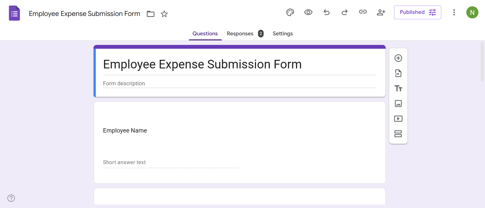
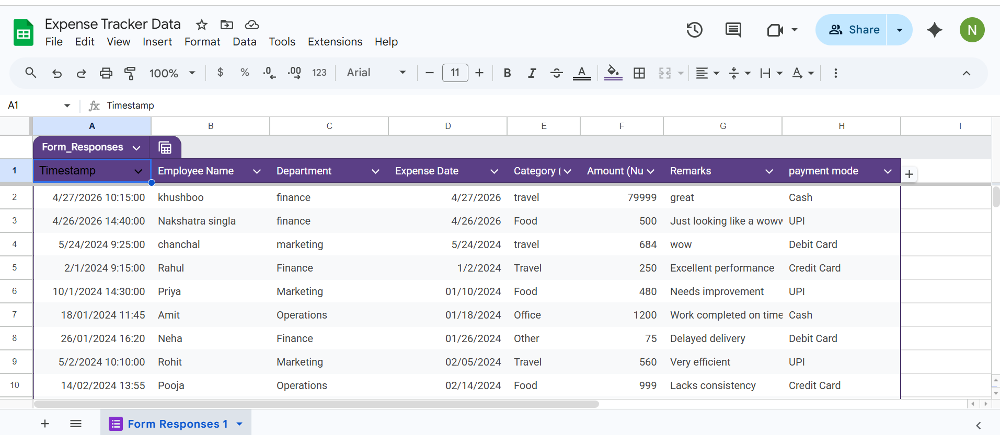
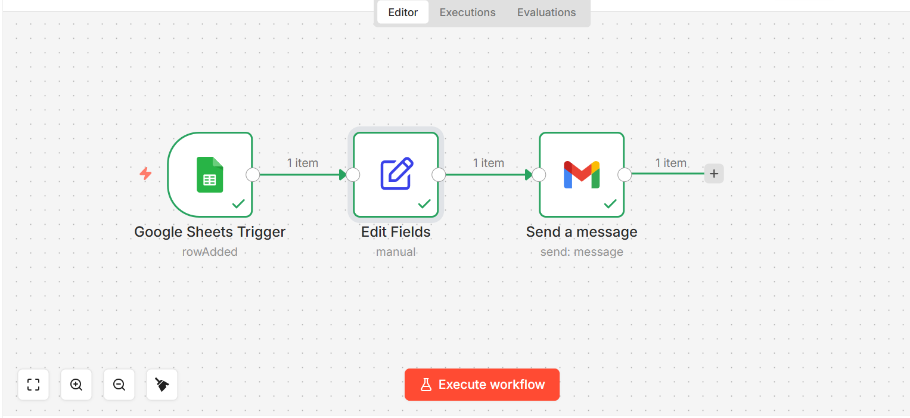
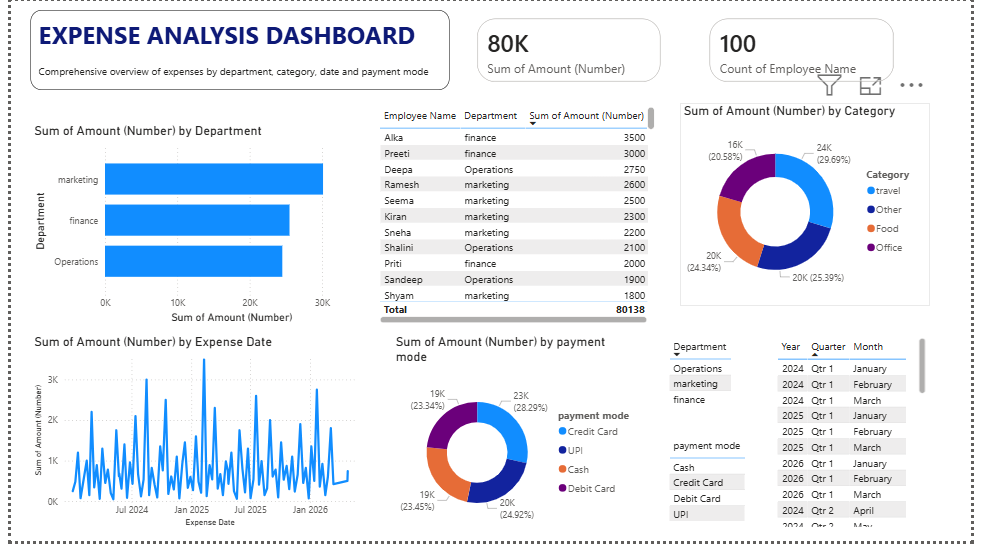
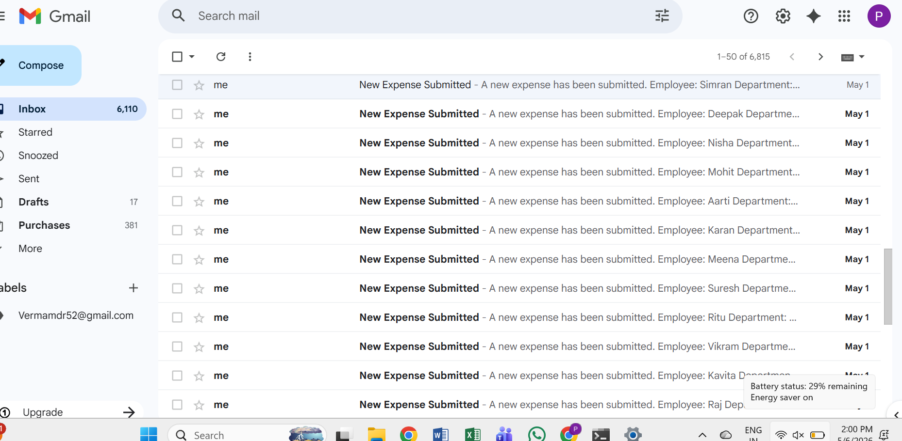

# 💰 AI Expense Tracker & Finance Automation System

An end-to-end AI-powered expense tracking and finance automation solution built using **Google Forms, Google Sheets, n8n workflow automation, and Power BI dashboards**.

This project automates expense collection, processing, storage, analytics, and visualization to help individuals or businesses track spending in real-time with minimal manual effort.

---

# 🚀 Features

- 📋 Expense submission using Google Forms
- 🔄 Automated workflow processing with n8n
- 📊 Real-time analytics dashboard in Power BI
- ☁️ Centralized data storage in Google Sheets
- 📈 Expense trend analysis and financial insights
- 🤖 AI-ready finance automation architecture
- ⚡ No-code / low-code implementation

---

# 🏗️ System Architecture

The workflow follows this pipeline:

1. User submits expense data through Google Form
2. Data is stored automatically in Google Sheets
3. n8n workflow processes and automates operations
4. Power BI fetches data for visualization and analytics
5. Dashboard provides insights and tracking metrics

---

# 🛠️ Tech Stack

| Tool | Purpose |
|------|----------|
| Google Forms | Expense data collection |
| Google Sheets | Data storage |
| n8n | Workflow automation |
| Power BI | Dashboard & analytics |
| Python | Data handling & AI enhancements |

---

# 📂 Project Structure

```bash
AI-Expense-Tracker/
│
├── README.md
├── email_output.png.png
├── google_form.png
├── google_sheet.png
├── n8n_architecture.png.png
├── powerbi_dashboard.png
└── notebooks/
```

---

# 📸 Screenshots

## 📋 Google Form



---

## 📊 Google Sheet Database



---

## 🔄 n8n Workflow Automation



---

## 📈 Power BI Dashboard



---

## 📧 Automated Email Output



---

# ⚙️ Workflow Automation

The automation pipeline performs the following:

- Captures user expense entries
- Validates and stores records
- Sends automated notifications/emails
- Updates dashboard datasets
- Generates real-time analytics

---

# 📊 Dashboard Insights

The Power BI dashboard includes:

- Total Expenses
- Monthly Spending Trends
- Category-wise Expense Breakdown
- Expense Forecasting
- Real-time Financial Monitoring

---

# 🔮 Future Improvements

- AI-based expense prediction
- Receipt OCR scanning
- WhatsApp/Telegram notifications
- Fraud detection system
- Voice-based expense logging
- Mobile application integration

---

# 🧠 Learning Outcomes

This project demonstrates:

- Workflow automation
- Real-time data integration
- Business intelligence reporting
- Finance analytics
- No-code AI system architecture

---

# 📌 Use Cases

- Personal finance tracking
- Startup expense management
- Small business accounting
- Automated financial reporting
- AI-powered budgeting systems

---

# 📄 License

This project is licensed under the MIT License.

---

# 🙌 Author

Developed by Pawni Bhatia

Feel free to contribute, fork, and enhance this project.

---
